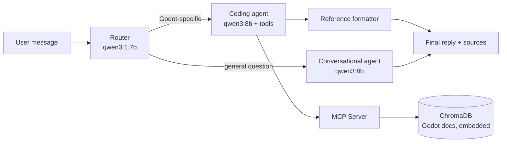

# Godot Expert AI

A retrieval-augmented agent that answers questions about the Godot game engine by searching the **current** official documentation — instead of relying on a model's training data, which is reliably out of date for a fast-moving open-source engine and prone to hallucinating APIs from older Godot versions.

## Why this exists

Generic coding assistants are unreliable for Godot specifically: Godot 3 → 4 changed large parts of the scripting API, and a model trained on a mix of both versions will confidently mix syntax from each. This project sidesteps that by treating the model as a *reasoning and retrieval* layer, not a source of truth — every factual answer is expected to be backed by a live search against the official docs, with the exact source page cited back to the user.

## Architecture



The system is two independently deployable services:

- **`mcp_server/`** — an MCP server exposing a single tool, `search_godot_docs`, backed by a ChromaDB vector store built from the official [godot-docs](https://github.com/godotengine/godot-docs) `.rst` source. Ingestion, chunking, and retrieval live here, completely decoupled from the agent that consumes them.
- **`agent/`** — a LangGraph workflow that routes each message, then either answers directly (conversational path) or delegates to a tool-using agent that queries the MCP server and formats its answer with citations (coding path).

### Design decisions

**Two-tier model routing, not one model for everything.** A small classifier (`qwen3:1.7b`) decides up front whether a message needs Godot-specific expertise. Trivial or off-topic messages never pay the cost of loading tool definitions or running a multi-step agent loop — only questions that actually need retrieval hit the heavier path. The router is a structured-output classifier (a Pydantic schema, not free-text parsing), so routing decisions are deterministic and easy to log/eval independently of the rest of the system.

**Citations are enforced in code, not prompted for.** Rather than trusting the model to consistently format a references section, the MCP tool returns structured `{text, url}` results, the agent extracts every URL surfaced by a tool call during the turn, and a dedicated formatting step appends a deduplicated, consistently-formatted reference list after the model has finished reasoning. This guarantees citation formatting regardless of model behavior under long contexts or multiple tool calls.

**Language-aware chunking.** Godot's docs mix GDScript, C#, and C++ examples in the same page via Sphinx `.. tabs::` blocks. Naively chunking that content produces embeddings that blend multiple languages together, making "give me the C# version" unanswerable by retrieval alone. The ingestion pipeline parses `.. tabs::` / `.. code-tab::` directives explicitly and emits one chunk per language variant, tagged with a `language` metadata field, so the tool can filter results by language on request rather than relying on the embedding to encode a categorical distinction it was never trained to capture.

**Ingestion and query embedding are structurally coupled, not just "kept in sync by convention."** An early version of this project embedded documents at ingest time and queried with a separately loaded model — a subtle bug where a mismatch (or even a forgotten normalization flag) silently produces plausible-looking but meaningless nearest-neighbor results. The current version registers the embedding function directly on the Chroma collection at creation time, so any client that opens the collection automatically uses the exact same model and settings used to build it — the class of bug is eliminated structurally rather than through documentation.

**The MCP server is deliberately dumb about presentation.** It returns raw chunks and metadata; it has no opinion on how an agent should format an answer. This keeps the tool reusable by any MCP client, not just this one LangGraph workflow.

## Requirements

- **Docker** and **Docker Compose** (with the buildx plugin)
- **Ollama**, running locally, with two models pulled:
  ```bash
  ollama pull qwen3:1.7b   # router
  ollama pull qwen3:8b     # conversational + coding agent
  ```
  *(Note: requiring a separately-managed local Ollama install is a temporary solution to avoid issues with getting access to GPU resources inside the dev stack — containerizing Ollama alongside the rest of the stack is on the near-term roadmap below.)*

## Running it

```bash
git clone https://github.com/jsturtz/godot-expert-ai.git
cd godot-expert-ai
docker compose up --build
```

On first run, the MCP server clones the official Godot docs, chunks and embeds them into a local ChromaDB instance, and starts serving the `search_godot_docs` tool. This takes a few minutes the first time; subsequent starts reuse the cached index and only rebuild if the upstream docs have changed.

- MCP server: `http://localhost:8000`
- LangGraph agent (API / dev server): `http://localhost:2024`

## Demo

https://github.com/user-attachments/assets/611c0ed1-2696-4735-aeb6-54b6f37e6f21

## Roadmap

- Containerize Ollama so the whole stack runs with a single `docker compose up`, no separately-managed local dependency
- Human-in-the-loop pipeline-improvement agent: an agent that evaluates `search_godot_docs` output against a golden query set, inspects the ingestion code to diagnose poor retrieval, and proposes a code change for a human to review and merge — decoupled from the MCP server itself so it's safe to let it modify the tool's own implementation
- Version-aware documentation URLs (currently pinned to `stable`)
- A small evaluation set for the router's classification accuracy and the retrieval pipeline's recall
